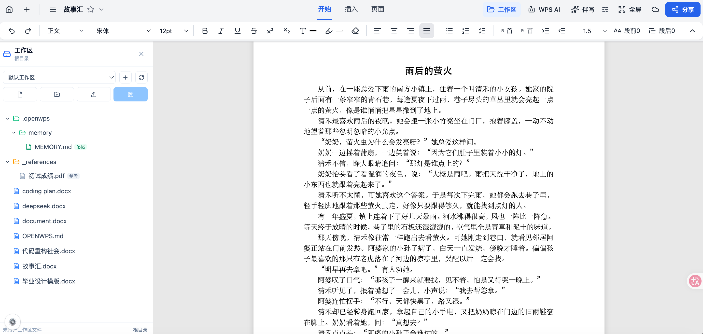

# openwps

openwps 是一个 AI 原生的在线文档编辑器，用自然语言完成文档写作、内容修改、精确排版、资料引用和结果检查，面向报告、方案、论文、小说、公文等需要长期维护和细致排版的文档生产场景。

它的核心不是简单生成一段文本，而是让 AI 在工作区、模板、记忆和文档工具之间持续协作，把从资料整理到最终版式验收的过程串成可执行的文档工作流。



## 目录

- [为什么不是 WPS AI](#为什么不是-wps-ai)
- [核心能力](#核心能力)
- [文档工程能力](#文档工程能力)
- [Agent-native 架构](#agent-native-架构)
- [后端工具执行与文档会话](#后端工具执行与文档会话)
- [工作区与记忆](#工作区与记忆)
- [子 Agent 机制](#子-agent-机制)
- [视觉验证与无头浏览器](#视觉验证与无头浏览器)
- [技术栈](#技术栈)
- [快速开始](#快速开始)
- [配置 AI](#配置-ai)
- [常用脚本](#常用脚本)
- [测试](#测试)
- [部署](#部署)
- [项目结构](#项目结构)
- [贡献指南](#贡献指南)
- [License](#license)

## 为什么不是 WPS AI

传统办公软件里的 AI 往往是附加在编辑器侧边的能力：用户打开文档，AI 生成一段内容或给出建议，最终仍由人负责复制、粘贴、调整格式、检查分页和维护资料上下文。

openwps 的目标不同：文档本身是 Agent 的工作对象，AI 可以围绕一个明确目标完成“读取资料 -> 规划结构 -> 编写正文 -> 调用工具修改文档 -> 调整排版 -> 截图检查 -> 继续修复 -> 输出结果”的闭环。

这带来几个关键差异：

- **AI 掌控全流程**：AI 不只回答问题，还能直接调用写作、替换、加粗、下划线、段落样式、插入表格、插入图片、目录、分页等文档工具。
- **编辑器是可执行环境**：ProseMirror 文档模型、Pretext 分页结果、后端文档会话和工作区文件共同构成 AI 可读写的运行时。
- **后端是事实来源**：ReAct 主循环、工具调度、任务状态、上下文 delta、workspace manifest、OCR、联网搜索、文档写入和写后验证都在后端。
- **前端主要负责显示与人工微调**：React 前端展示分页文档、工具轨迹、AI SSE 事件、子 Agent 过程，并允许用户手动调整。
- **工作区不只是上传附件**：openwps 有类似 VS Code 的 workspace，保存当前要编辑的文件、只读参考资料和长期记忆。
- **Harness 是产品核心**：工具提示词注入、延迟工具加载、执行计划、并发安全、上下文压缩恢复、子 Agent 隔离和视觉验收都属于系统能力。

## 核心能力

- **AI 内容生产**：根据用户目标、当前文档、工作区资料和长期记忆生成正文、改写段落、扩写结构或补全章节。
- **AI 排版执行**：通过工具直接修改文字样式、段落样式、页面设置、目录、分页符、表格、图片和 Mermaid 图表。
- **精确分页**：基于 [@chenglou/pretext](https://github.com/chenglou/pretext) 的纯算术分页，不依赖浏览器 DOM 重排。
- **结构化文档模型**：ProseMirror schema 管理段落、样式、列表、表格、图片、批注等文档状态。
- **Tool Harness**：每个工具有读写权限、执行位置、是否可并发、是否延迟加载、是否允许子 Agent 使用等元数据。
- **上下文工程**：后端注入 system prompt、工具原则、tooling delta、工作区 manifest、文档快照和压缩恢复附件。
- **工作区资料检索**：支持普通可编辑文件、`_references/` 只读资料、PDF/PPT/DOCX/MD/TXT 提取文本搜索。
- **长期记忆**：`.openwps/memory/` 保存用户偏好、项目背景、反馈、参考位置或小说大纲等长期信息。
- **子 Agent 调度**：内置调研、写作规划、排版分析、图片分析和结果验收子代理。
- **视觉验收**：后端可用 Playwright/headless renderer 渲染页面并截图，用于检查分页、遮挡、图文混排和表格附近效果。
- **持久会话网关**：后端维护可查询、可取消、可持续拉取事件的 ReAct run，适合外部客户端接入；聊天软件适配层暂未对接。

## 文档工程能力

除了 Agent 编排，openwps 也覆盖了文档编辑器应具备的基础工程能力：

- **DOCX / Markdown 往返**：支持 DOCX 导入导出、Markdown 导入、任务列表、表格、图片、链接、内联样式、列表层级、页面设置和自动目录等结构。
- **OOXML 样式还原**：DOCX 导入会解析字体、字号、颜色、加粗、下划线、上下标、段落缩进、行距、段前段后、标题级别、列表编号、页边距和文档网格等信息。
- **模板库与 AI 套版**：可以上传 DOCX 模板，由后端模板分析器提取“文档定位、页面版心、结构顺序、样式规范、特殊格式、套版指令”，再让 AI 在后续任务中引用。
- **批注与审阅**：支持选区批注、批注弹窗、右侧批注卡片、批注定位、回复、删除和解决，适合文档审阅流程。
- **AI 伴写补全**：编辑器内置短文本续写接口，可基于光标前后文、相邻段落和文档统计生成 1-3 条候选，并在正文中预览/接受。
- **Slash / OCR 快捷入口**：AI 侧边栏支持 `/ocr` 快捷命令，也能根据“识别、提取、解析”等自然语言意图触发 OCR；任务类型覆盖表格、图表、手写、公式和文档正文。
- **多提供商模型配置**：内置硅基流动、OpenAI、OpenRouter、Groq、Ollama 等 OpenAI 兼容提供商，支持模型发现、视觉能力、prompt cache、OCR 和 Tavily 搜索配置。
- **复杂编辑器细节**：包含任务列表交互、表格行列编辑、图片缩放、Mermaid 图表、工具栏紧凑布局、中文字体栈、中英文混排和全角标点排版适配。

## Agent-native 架构

openwps 的核心不是“前端调用一个聊天接口”，而是后端维护一个文档 Agent 运行时。

```text
用户目标
  |
  v
后端 ReAct 主循环
  |
  +-- 构建 system prompt / 工具提示词 / tooling delta / workspace manifest
  +-- 绑定当前可用工具 schema
  +-- 接收模型 tool_calls
  +-- 生成执行计划、合并批量样式操作、分配并发组
  +-- 执行服务端工具：文档读写、工作区、搜索、OCR、截图、子 Agent
  +-- 将 ToolMessage、上下文 delta、任务状态和压缩恢复附件回灌模型
  |
  v
文档会话 / 工作区文件 / SSE 事件 / 前端分页显示
```

关键设计：

- **ReAct 主循环**：模型不是一次性回答，而是在多轮中读取文档、调用工具、接收结果、继续决策，直到达到停止条件。
- **工具计划化**：模型输出的 tool calls 会先变成执行计划，带有 `executorLocation`、`readOnly`、`allowedForAgent`、`parallelSafe` 等元数据。
- **ToolSearch 延迟加载**：复杂或低频工具不必首轮全部暴露给模型；模型先用 `ToolSearch` 加载完整 schema，再在下一轮调用。
- **上下文 delta**：工作区、模板、文档状态变化以系统附件方式注入，避免每轮重复塞入完整上下文。
- **压缩恢复**：上下文压缩后，后端重新注入文档快照、任务快照、最近读取摘要和工具 delta，使 Agent 能继续工作。
- **停止与预算控制**：后端检测重复工具调用、能力不可用、预算风险和最大轮次，必要时给模型提示或收口。
- **Prompt cache 友好**：system prompt 与 tool schema hash 参与缓存 key，降低长上下文工具系统的重复成本。

## 后端工具执行与文档会话

在当前实现中，AI 工具统一交给后端执行。即使是加粗、下划线、插入表格、替换段落、插入图片这类看起来属于编辑器前端的动作，也会通过后端文档会话和 Node worker 运行。

这条边界很重要：

- **AI 写入不依赖前端状态机**：前端不决定 ReAct 是否继续，也不判断工作区文件是否新增。
- **文档工具可被审计**：每次工具调用都有执行计划、参数、结果、文档版本和事件。
- **写入后同步前端**：后端工具成功后发布 `document_replace` 或 `page_config_changed` 事件，前端只负责展示最新文档。
- **工作区文件可自动写回**：如果当前文档来自 workspace，后端文档会话变更后可以保存回对应文件。
- **结构保护可介入**：排版阶段可以阻止样式工具意外改变正文文本或顶层结构。

后端可执行的文档工具覆盖：

- 读取：文档信息、目录、全文、单页、单段、样式摘要、批注、文本搜索。
- 写作：长文 Markdown 写入、插入短文本、插入段落、替换段落、替换选区、删除选区、删除段落。
- 样式：内联文字样式、段落样式、清除格式、批量样式、页面设置。
- 结构：分页符、水平线、自动目录、表格插入、表格行列增删、整表删除。
- 媒体：图片插入、Mermaid 图表渲染、文档图片分析、页面截图。

## 工作区与记忆

openwps 的 workspace 更接近 VS Code 的项目工作区，而不是一次性的文件上传列表。

```text
workspace files/
├── report.docx              # 可编辑文档
├── draft.md                 # 可编辑文档
├── _references/             # 只读参考资料
│   ├── spec.pdf
│   └── examples.docx
└── .openwps/
    ├── index/               # 后端提取文本索引
    ├── versions/            # 文件快照
    └── memory/
        ├── MEMORY.md        # 记忆索引
        └── novel-outline.md # 具体长期记忆
```

工作区能力包括：

- **可编辑文件**：DOCX、MD、TXT 等可以打开为当前活动文档，AI 修改后可写回工作区。
- **只读参考资料**：`_references/` 下的 PDF、PPT、DOCX、MD、TXT 用于检索和引用，默认不作为编辑目标。
- **manifest 注入**：后端把 workspace manifest 注入模型上下文，并在工具执行后刷新 delta。
- **全文搜索**：`workspace_search` 可在普通文件、参考资料或记忆中定位关键词、条款、数据和范文。
- **长期记忆**：用户可以要求 AI “记住”写作偏好、项目背景、角色设定、小说大纲或反馈，AI 通过 `workspace_memory_write` 写入 `.openwps/memory/` 并维护 `MEMORY.md` 索引。
- **按需读取**：记忆索引会先进入 manifest，具体记忆文件按任务相关性选择读取，避免把所有长期信息一次性塞进上下文。

## 子 Agent 机制

openwps 的主 Agent 可以把适合并行或隔离的只读任务委托给子 Agent。子 Agent 不能直接修改文档、样式、任务或工作区，只能读取、分析、检索、截图、验收并把建议返回给父 Agent。

内置子 Agent：

| 子 Agent | 用途 |
| --- | --- |
| `document-research` | 读取当前文档、工作区和网页资料，汇总证据、外部资料和推断 |
| `writing-plan` | 为写作、改写、扩写生成结构化写作计划 |
| `layout-plan` | 分析页面排版、标题、正文、列表、目录、图片和表格附近问题 |
| `image-analysis` | 分析文档内图片，选择 OCR、多模态或组合路径 |
| `verification` | 检查主 Agent 执行后的文档状态，输出 `PASS` / `PARTIAL` / `FAIL` |

典型流程：

1. 主 Agent 改写或排版文档。
2. 主 Agent 启动 `verification` 子 Agent，并传入原始目标、执行动作和重点页码。
3. 子 Agent 读取文档结构、页面内容、样式摘要，必要时调用页面截图。
4. 子 Agent 返回证据和结论。
5. 主 Agent 根据 `PASS` / `PARTIAL` / `FAIL` 决定收口、说明限制或继续修复。

## 视觉验证与无头浏览器

文档排版不能只靠结构化 JSON 判断。openwps 后端可以启动 Playwright，在无头浏览器中加载前端 Pretext 渲染器，注入当前 ProseMirror 文档和页面配置，等待页面真实分页完成后截图。

这使 AI 能处理传统文本工具难以判断的问题：

- 图片是否压住正文。
- 表格是否跨页异常。
- 标题层级是否在视觉上成立。
- 分页符和段前分页是否生效。
- 图文混排、页边距、段间距和遮挡是否符合预期。
- Mermaid 图表是否能在服务端渲染为图片再插入文档。

视觉截图结果不会把大体积图片长期塞进普通文本上下文；后端会把页面元数据、必要的多模态分析结果和安全摘要回灌给 Agent。

## 技术栈

| 层 | 技术 |
| --- | --- |
| 前端 | React 19、TypeScript、Vite |
| 编辑器 | ProseMirror、prosemirror-tables |
| 分页布局 | @chenglou/pretext |
| 样式 | Tailwind CSS v4、lucide-react |
| 文档处理 | mammoth、docx、JSZip、marked、OOXML 解析 |
| 后端 | Python、FastAPI、Uvicorn |
| AI 编排 | LangGraph、langchain-openai、tiktoken |
| 工具运行时 | FastAPI 文档会话、Node worker、Playwright headless renderer |
| 外部能力 | OpenAI 兼容模型、Tavily web search、OCR、多模态视觉模型 |
| 测试 | TypeScript、ESLint、Playwright、后端测试 |

## 快速开始

### 环境要求

- Node.js 与 npm
- Python 3
- 可用的大模型 API Key
- 如需联网搜索，需要 Tavily API Key
- 如需截图或视觉验收，需要安装前端依赖中的 Playwright 运行时

### 安装依赖

```bash
npm install
pip3 install -r server/requirements.txt --break-system-packages
```

如果本机 Python 环境不允许全局安装，建议先创建虚拟环境：

```bash
python3 -m venv .venv
source .venv/bin/activate
pip install -r server/requirements.txt
```

### 启动开发环境

终端 1 启动后端：

```bash
python3 server/main.py
```

终端 2 启动前端：

```bash
npm run dev
```

访问：

- 前端开发地址：`http://localhost:5173`
- 后端健康检查：`http://localhost:5174/api/health`

### 生产模式本地运行

```bash
npm run build
python3 server/main.py
```

构建后访问 `http://localhost:5174`。

也可以使用项目脚本：

```bash
npm run start:prod
```

## 配置 AI

启动前后端后，在页面设置中配置大模型提供商、模型和 API Key。配置会保存在后端本地文件中，不会提交到 Git。

关键说明：

- AI 配置文件：`server/config/ai.json`
- 该文件包含敏感信息，已在 `.gitignore` 中排除
- 后端支持 OpenAI 兼容接口，可配置硅基流动、OpenAI、Claude、Ollama 或自定义端点
- 联网搜索由 Tavily 提供，需要在设置中单独启用并填写 Tavily API Key
- OCR 与视觉分析可按模型和服务能力配置
- Tavily API Key、模型 API Key 和 OCR/视觉配置都只保存在后端

可用健康检查：

```bash
curl -s http://localhost:5174/api/health
```

期望返回：

```json
{"status":"ok","service":"openwps-backend"}
```

## 常用脚本

| 命令 | 说明 |
| --- | --- |
| `npm run dev` | 启动 Vite 前端开发服务器，默认端口 `5173` |
| `npm run build` | 构建 worker、执行 TypeScript 编译并打包前端 |
| `npm run lint` | 运行 ESLint |
| `npm run preview` | 预览前端构建产物 |
| `npm run start:prod` | 构建前端并启动后端生产服务 |
| `python3 server/main.py` | 启动 FastAPI 后端，默认端口 `5174` |
| `bash scripts/deploy.sh` | 构建并重启生产服务，包含健康检查 |

## 测试

前端代码改动后至少运行：

```bash
npm run build
```

可选检查：

```bash
npm run lint
```

项目内置多组 Playwright 场景测试：

```bash
node scripts/test-typography.cjs
node scripts/test-comment-dialog.cjs
node scripts/test-markdown-import.cjs
node scripts/test-docx-toc.cjs
node scripts/test-task-list.cjs
node scripts/test-table-layout.cjs
node scripts/test-table-boundary-delete.cjs
node scripts/test-block-controls.cjs
node scripts/test-ai-copilot.cjs
node scripts/test-toolbar-overlap.cjs
```

也可以运行 Python 版排版测试：

```bash
python3 scripts/run-tests.py
```

注意：

- 多数 E2E 测试需要 `npm run dev` 已在 `5173` 运行，或已有可访问的构建预览服务。
- `scripts/test-comment-dialog.cjs` 默认连接 `http://127.0.0.1:4173`，可通过 `BASE_URL` 覆盖。
- 测试截图输出到 `screenshots/`。

## 部署

推荐使用一键脚本：

```bash
bash scripts/deploy.sh
```

手动部署流程：

```bash
npm run build
pkill -f "python3 server/main.py" 2>/dev/null
nohup python3 server/main.py &>/tmp/openwps-server.log &
sleep 3
curl -s http://localhost:5174/api/health
```

生产部署时只需要后端端口 `5174`。FastAPI 会托管 `dist/`，并在同一端口提供 `/api/*`。

更多部署细节见 [DEPLOY.md](DEPLOY.md)。

## 项目结构

```text
openwps/
├── src/                 # 前端源码
│   ├── components/      # 编辑器、工具栏、AI 侧边栏、工作区、设置等 React 组件
│   ├── editor/          # ProseMirror schema 与节点视图
│   ├── layout/          # Pretext 分页引擎接入
│   ├── ai/              # 前端 AI 展示、工具类型和提供商类型
│   ├── shared/          # 文档工具、schema、快照与范围逻辑
│   ├── docx/            # DOCX 导入导出
│   ├── markdown/        # Markdown 导入
│   └── templates/       # 模板分析相关代码
├── server/              # Python FastAPI 后端
│   ├── app/             # AI 编排、工具注册、文档会话、工作区、任务和路由
│   ├── node/            # 文档处理 worker
│   ├── tests/           # 后端测试
│   ├── main.py          # 后端入口
│   └── requirements.txt # Python 依赖
├── docs/                # 架构与实现文档
├── scripts/             # 部署、E2E、CLI 与回归测试脚本
├── public/              # 静态资源
├── screenshots/         # 测试与展示截图
└── dist/                # 前端构建产物，已 gitignore
```

## 贡献指南

欢迎通过 issue 和 pull request 参与改进。提交前建议先确认改动边界：

1. 前端交互、分页可视层、AI 事件展示和用户手动编辑逻辑放在 `src/`。
2. AI 编排、工具调度、文档会话、workspace manifest、记忆、联网搜索、OCR 和视觉验证放在 `server/`。
3. AI 工具默认以后端执行为准，不要把 ReAct 状态机、是否继续运行、workspace delta 判断放回前端。
4. 涉及 ProseMirror 与 Pretext 的功能，需要同时验证隐藏编辑层和可见分页层。
5. 前端改动后运行 `npm run build`。
6. 后端改动后重启 `python3 server/main.py`，并检查 `http://localhost:5174/api/health`。
7. 不要提交 `server/config/ai.json`、`server/data/`、`dist/`、`node_modules/` 或本地敏感配置。

代码风格以 ESLint、TypeScript 严格配置和现有项目风格为准。纯类型导入请使用 `import type`。

## License

本项目采用 MIT License 开源，详见 [LICENSE](LICENSE)。
