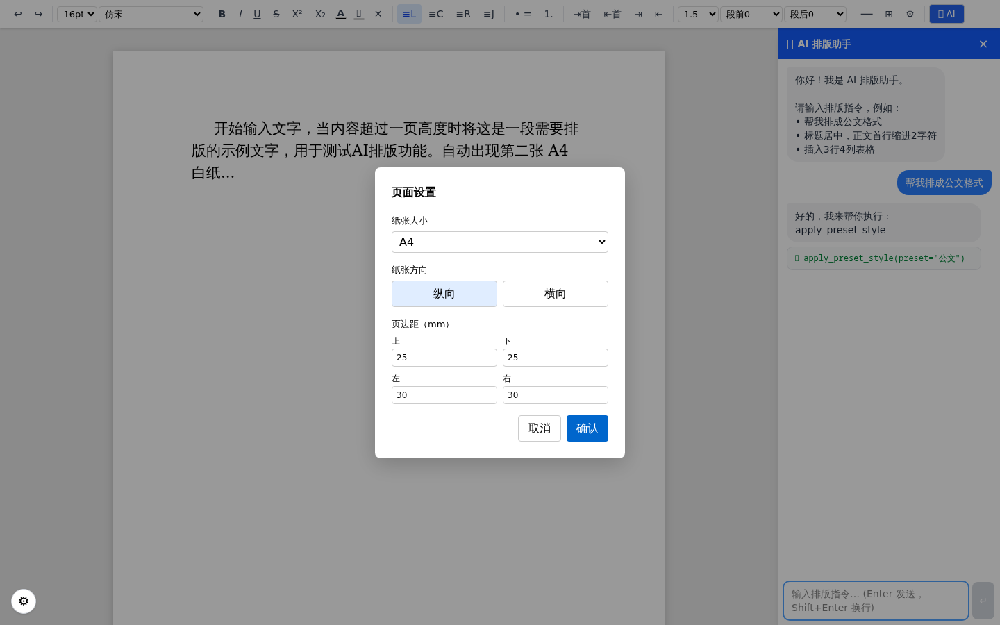

# openwps

AI 驱动的 WPS 级 Web 文档编辑器，基于 React、ProseMirror、Pretext、FastAPI 与 LangGraph 构建。

openwps 面向需要在线编辑、精确分页、智能排版和 AI 文档助手的场景。前端提供类办公软件的编辑体验，后端负责 AI 编排、工具调用、文档会话和工作区事实管理，生产环境可通过单端口部署运行。



## 目录

- [功能特性](#功能特性)
- [技术栈](#技术栈)
- [架构概览](#架构概览)
- [快速开始](#快速开始)
- [配置 AI](#配置-ai)
- [常用脚本](#常用脚本)
- [测试](#测试)
- [部署](#部署)
- [项目结构](#项目结构)
- [贡献指南](#贡献指南)
- [License](#license)

## 功能特性

- **精确分页**：基于 [@chenglou/pretext](https://github.com/chenglou/pretext) 的纯算术分页，不依赖 DOM 重排。
- **富文本编辑**：支持字体、字号、颜色、对齐、缩进、行距、列表、表格、分页符、批注等常见排版能力。
- **ProseMirror 文档模型**：使用结构化 schema 管理文档状态，便于导入、导出、编辑和 AI 工具操作。
- **AI 排版助手**：通过自然语言驱动文档编辑、排版建议、内容处理和工具调用。
- **流式响应**：基于 SSE 展示 AI 输出、思考过程、工具调用和子代理轨迹。
- **后端 ReAct 编排**：LangGraph 负责多轮推理、任务状态、停止条件和工具调度。
- **文档导入导出**：支持 Markdown、DOCX 等文档格式的导入和处理能力。
- **联网搜索与 OCR**：后端集成 Tavily web search，并提供图片 OCR 分析接口。
- **会话与工作区管理**：后端持久化会话、文档、模板和工作区 manifest。
- **单端口生产部署**：构建后的前端由 FastAPI 托管，生产环境只需访问后端端口。

## 技术栈

| 层 | 技术 |
| --- | --- |
| 前端 | React 19、TypeScript、Vite |
| 编辑器 | ProseMirror、prosemirror-tables |
| 分页布局 | @chenglou/pretext |
| 样式 | Tailwind CSS v4、lucide-react |
| 文档处理 | mammoth、docx、JSZip、marked |
| 后端 | Python、FastAPI、Uvicorn |
| AI 编排 | LangGraph、langchain-openai、tiktoken |
| 外部能力 | Tavily web search、OCR、文档工具 |
| 测试 | TypeScript、ESLint、Playwright、pytest 风格后端测试 |

## 架构概览

开发环境中，前端和后端分别运行：

```text
浏览器 -> http://localhost:5173
              |
              | Vite proxy /api
              v
           http://localhost:5174/api
```

生产环境中，后端托管构建产物并提供 API：

```text
浏览器 -> http://localhost:5174
              ├── /        前端静态资源
              └── /api/*   FastAPI 后端接口
```

核心职责边界：

- `src/` 负责编辑器交互、分页可视层、AI 事件展示、工具轨迹展示和用户手动编辑。
- `server/` 负责 AI 主循环、工具调度、工作区 manifest、文档会话、OCR、联网搜索和写后验证。
- 文档状态由 ProseMirror 维护结构化模型，分页显示由 Pretext 生成布局数据并交给可见层渲染。
- AI 运行时以后端文档会话和工具接口为事实来源，避免前后端各自维护 AI 状态机。

更多分页引擎说明见 [docs/PRETEXT.md](docs/PRETEXT.md)。

## 快速开始

### 环境要求

- Node.js 与 npm
- Python 3
- 可用的大模型 API Key；如需联网搜索，还需要 Tavily API Key

### 安装依赖

```bash
npm install
pip3 install -r server/requirements.txt --break-system-packages
```

如果本机 Python 环境不允许全局安装，建议先创建虚拟环境：

```bash
python3 -m venv .venv
source .venv/bin/activate
pip install -r server/requirements.txt
```

### 启动开发环境

终端 1 启动后端：

```bash
python3 server/main.py
```

终端 2 启动前端：

```bash
npm run dev
```

访问：

- 前端开发地址：`http://localhost:5173`
- 后端健康检查：`http://localhost:5174/api/health`

### 生产模式本地运行

```bash
npm run build
python3 server/main.py
```

构建后访问 `http://localhost:5174`。

也可以使用项目脚本：

```bash
npm run start:prod
```

## 配置 AI

启动前后端后，在页面设置中配置大模型提供商、模型和 API Key。配置会保存在后端本地文件中，不会提交到 Git。

关键说明：

- AI 配置文件：`server/config/ai.json`
- 该文件包含敏感信息，已在 `.gitignore` 中排除
- 后端支持 OpenAI 兼容接口，可配置硅基流动、OpenAI、Claude、Ollama 或自定义端点
- 联网搜索由 Tavily 提供，需要在设置中单独启用并填写 Tavily API Key
- Tavily API Key 仅保存在后端，浏览器端不会直接持有该 Key

可用健康检查：

```bash
curl -s http://localhost:5174/api/health
```

期望返回：

```json
{"status":"ok","service":"openwps-backend"}
```

## 常用脚本

| 命令 | 说明 |
| --- | --- |
| `npm run dev` | 启动 Vite 前端开发服务器，默认端口 `5173` |
| `npm run build` | 构建 worker、执行 TypeScript 编译并打包前端 |
| `npm run lint` | 运行 ESLint |
| `npm run preview` | 预览前端构建产物 |
| `npm run start:prod` | 构建前端并启动后端生产服务 |
| `python3 server/main.py` | 启动 FastAPI 后端，默认端口 `5174` |
| `bash scripts/deploy.sh` | 构建并重启生产服务，包含健康检查 |

## 测试

前端代码改动后至少运行：

```bash
npm run build
```

可选检查：

```bash
npm run lint
```

项目内置多组 Playwright 场景测试：

```bash
node scripts/test-typography.cjs
node scripts/test-comment-dialog.cjs
node scripts/test-markdown-import.cjs
node scripts/test-docx-toc.cjs
node scripts/test-task-list.cjs
node scripts/test-table-layout.cjs
node scripts/test-table-boundary-delete.cjs
node scripts/test-block-controls.cjs
node scripts/test-ai-copilot.cjs
node scripts/test-toolbar-overlap.cjs
```

也可以运行 Python 版排版测试：

```bash
python3 scripts/run-tests.py
```

注意：

- 多数 E2E 测试需要 `npm run dev` 已在 `5173` 运行，或已有可访问的构建预览服务。
- `scripts/test-comment-dialog.cjs` 默认连接 `http://127.0.0.1:4173`，可通过 `BASE_URL` 覆盖。
- 测试截图输出到 `screenshots/`。

## 部署

推荐使用一键脚本：

```bash
bash scripts/deploy.sh
```

手动部署流程：

```bash
npm run build
pkill -f "python3 server/main.py" 2>/dev/null
nohup python3 server/main.py &>/tmp/openwps-server.log &
sleep 3
curl -s http://localhost:5174/api/health
```

生产部署时只需要后端端口 `5174`。FastAPI 会托管 `dist/`，并在同一端口提供 `/api/*`。

更多部署细节见 [DEPLOY.md](DEPLOY.md)。

## 项目结构

```text
openwps/
├── src/                 # 前端源码
│   ├── components/      # 编辑器、工具栏、AI 侧边栏、设置等 React 组件
│   ├── editor/          # ProseMirror schema 与节点视图
│   ├── layout/          # Pretext 分页引擎接入
│   ├── ai/              # 前端 AI 展示相关类型与工具定义
│   ├── docx/            # DOCX 导入导出
│   ├── markdown/        # Markdown 导入
│   └── templates/       # 模板分析相关代码
├── server/              # Python FastAPI 后端
│   ├── app/             # 路由、AI 编排、配置、文档、工作区与工具
│   ├── node/            # 文档处理 worker
│   ├── tests/           # 后端测试
│   ├── main.py          # 后端入口
│   └── requirements.txt # Python 依赖
├── scripts/             # 部署、E2E、CLI 与回归测试脚本
├── docs/                # 架构与实现文档
├── public/              # 静态资源
├── screenshots/         # 测试与展示截图
└── dist/                # 前端构建产物，已 gitignore
```

## 贡献指南

欢迎通过 issue 和 pull request 参与改进。提交前建议先确认改动边界：

1. 前端交互、分页可视层和手动编辑逻辑放在 `src/`。
2. AI 编排、工具调度、文档会话、workspace manifest、联网搜索和 OCR 放在 `server/`。
3. 涉及 ProseMirror 与 Pretext 的功能，需要同时验证隐藏编辑层和可见分页层。
4. 前端改动后运行 `npm run build`。
5. 后端改动后重启 `python3 server/main.py`，并检查 `http://localhost:5174/api/health`。
6. 不要提交 `server/config/ai.json`、`server/data/`、`dist/`、`node_modules/` 或本地敏感配置。

代码风格以 ESLint、TypeScript 严格配置和现有项目风格为准。纯类型导入请使用 `import type`。

## License

本项目采用 MIT License 开源，详见 [LICENSE](LICENSE)。
