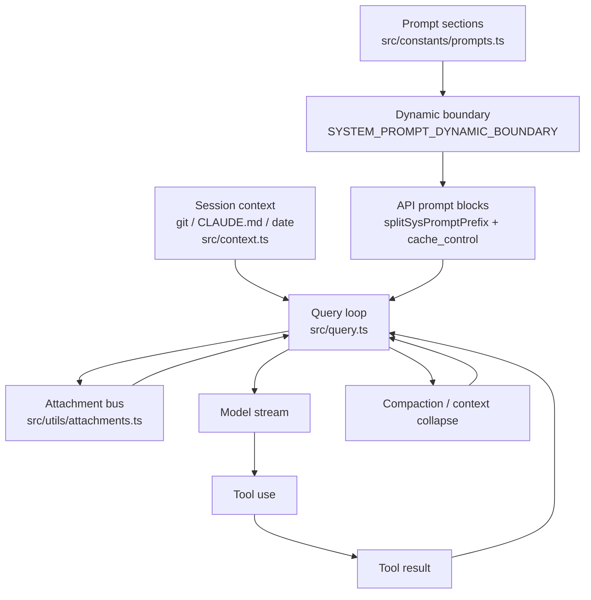
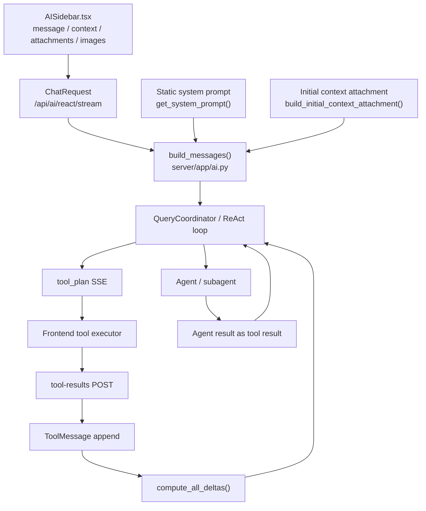

# Claude Code 与 OpenWPS Content 工程对比

## 1. 范围定义

本文中的 **Content 工程** 不是指某个名为 `content` 的目录，而是指模型在一次会话中实际看到、并持续影响决策的内容组织系统，主要包括：

- system prompt 的分段、拼装和缓存边界。
- 动态上下文，例如当前文档状态、选区、工作区文档、模板、git 状态、日期、记忆文件。
- 用户附件、图片、OCR 结果、队列命令、系统提醒等额外内容。
- 工具 schema、工具调用结果、工具执行后的上下文 delta。
- 压缩、裁剪、上下文恢复和子代理/Agent prompt。

Claude Code 的 Content 工程更像一个通用 CLI Agent 运行时的内容总线；OpenWPS 的 Content 工程更偏文档编辑场景，核心目标是把前端编辑器状态、文档附件、工具结果和排版/写作约束稳定交给后端模型循环。

## 2. Claude Code 的内容整合链路

### 2.1 System prompt 分段与缓存边界

Claude Code 的主 system prompt 由 `src/constants/prompts.ts` 组装。`getSystemPrompt()` 返回的是字符串数组，而不是单个大字符串，这让不同 section 可以在后续 API 层被单独处理。

关键设计点：

- 静态 section 放在前面，包括身份、任务处理方式、工具使用原则、风格要求等。
- 动态 section 通过 `systemPromptSection()` / `DANGEROUS_uncachedSystemPromptSection()` 注册和解析，包括 memory、环境信息、语言、MCP instructions、scratchpad、tool result clearing 等。
- `SYSTEM_PROMPT_DYNAMIC_BOUNDARY` 是明确的静态/动态分界线。boundary 前的内容更适合缓存，boundary 后的内容包含会话或环境相关变化。
- `src/utils/api.ts` 的 `splitSysPromptPrefix()` 根据 boundary 拆分 system prompt block。
- `src/services/api/claude.ts` 的 `buildSystemPromptBlocks()` 把拆好的 block 转为 Anthropic API 的 text block，并在可缓存 block 上加 `cache_control`。

这套结构的重点不是“把提示词写成多个文件”，而是把内容生命周期显式化：哪些内容长期稳定，哪些内容会在会话中变化，哪些变化会破坏 prompt cache。

### 2.2 会话级上下文

`src/context.ts` 提供会话启动时的上下文注入，典型内容包括：

- git status、当前 branch、recent commits。
- `CLAUDE.md` / memory files。
- 当前日期。
- 用于 cache breaking 的临时 system prompt injection。

这些上下文被 memoize，表示它们通常是“会话快照”，不是每一轮都重新扫描。Claude Code 因此把“启动时上下文”和“运行中附件/delta”区分开：前者进入稳定上下文，后者走 query loop 中的 attachment 机制。

### 2.3 Attachment 总线

`src/utils/attachments.ts` 是 Claude Code Content 工程里最接近“内容总线”的模块。`getAttachmentMessages()` 会把多种来源整理成 `AttachmentMessage`，再由 `src/query.ts` 在模型循环中插入。

常见 attachment 来源包括：

- `@` 引用文件、PDF reference、MCP resource。
- changed files、nested memory、dynamic skill、skill listing。
- MCP instructions delta。
- hook additional context、hook feedback。
- queued commands、team context、task notification。
- compaction reminder、context efficiency 提醒。

`src/query.ts` 在工具执行完成后、下一次模型请求前调用 `getAttachmentMessages()`。这样做有两个效果：

- 避免 tool result 和普通用户消息交错导致 API 消息结构错误。
- 让“刚发生的环境变化”以 meta message 方式进入下一轮模型判断。

### 2.4 工具结果与上下文压缩

Claude Code 的工具调用结果以 Anthropic message block 的 `tool_result` 形式回到对话。`query.ts` 同时负责处理：

- tool_use / tool_result 配对。
- 工具流式执行后的结果回收。
- prompt too long、media too long、context window exceeded 等错误恢复。
- auto compact、reactive compact、microcompact、context collapse。

因此 Claude Code 的 Content 工程不是单纯“插入提示词”，还包含对旧内容的保留、摘要、替换和恢复策略。模型看到的内容窗口会随着压缩策略变化，但工具结果配对和关键 attachment 需要继续保持语义完整。

### 2.5 Agent / Subagent 内容链路

Claude Code 的子代理也复用同一套内容原则：主线程和子代理通过独立 agent scope 处理队列命令、任务通知和工具输出。子代理的价值在于隔离上下文，避免主上下文被大量调研输出污染，同时把最终摘要或结果回灌给主循环。

## 3. OpenWPS 的内容整合链路

### 3.1 前端采集内容

OpenWPS 的实时文档状态主要在前端。`src/components/AISidebar.tsx` 在发起 `/api/ai/react/stream` 请求前收集：

- `message`：用户本轮输入。
- `history` / `reactMessages`：历史对话或 ReAct 会话消息。
- `context`：当前文档统计、预览、选区、激活模板、工作区文档列表等。
- `attachments`：文本附件的文件名、类型、大小、提取文本。
- `images`：多模态图片输入。
- `mode`、`model`、`providerId` 等运行参数。

前端还会把附件内容拼入用户可见的历史记录中，例如 `buildAttachmentContextBlock()` / `buildStoredUserContent()` 会把文本附件摘要化保存，图片附件在历史中只保留名称。

### 3.2 后端 system prompt 与动态上下文

OpenWPS 的模块化 prompt 在 `server/app/prompts_modular.py`。它已经引入了类似 Claude Code 的静态/动态分层思想：

- `get_static_sections(mode)` 生成身份、工作区、策略、工具选择、任务计划、回复规则等静态 section。
- `SYSTEM_PROMPT_DYNAMIC_BOUNDARY` 和 `assemble_system_prompt()` 表达了静态/动态边界。
- `get_dynamic_context_section(context)` 可以把文档上下文、选区、模板、工作区文档列表序列化为动态 section。

但当前实际主链路在 `server/app/ai.py` 的 `build_messages()` 中调用的是 `get_system_prompt(body.mode)`。这个函数只返回静态 section，动态上下文没有放进 system prompt，而是通过 attachment/delta 方式作为 `HumanMessage` 注入。

这和 Claude Code 有一个重要差异：OpenWPS 有 boundary 常量和完整组装函数，但目前还没有像 Claude Code 一样在 API 请求层把 boundary 前后的内容拆成 prompt cache block。

### 3.3 初始上下文与 delta 注入

`server/app/delta_injection.py` 是 OpenWPS 当前动态上下文注入的核心。

- `build_initial_context_attachment(context)` 在会话开始时生成完整上下文公告。
- `compute_all_deltas(context, messages, force_full=False)` 在后续轮次只生成变化内容。
- 变化类型包括 workspace docs、active template、selection、preview 等 context 字段。
- `force_full=True` 时会重新公告完整状态，适合压缩后恢复上下文。

`server/app/ai.py` 的 `build_messages()` 会先创建 `SystemMessage(content=get_system_prompt(...))`，再追加初始 context attachment 作为 `HumanMessage`。工具执行完成后，`QueryCoordinator` 会用前端最新回传的 `context` 调用 `compute_all_deltas()`，把变化追加到会话消息中。

这意味着 OpenWPS 的动态上下文更像“文档状态 delta 流”，而不是 system prompt 的动态尾部。

### 3.4 用户附件与多模态内容

`server/app/ai.py` 的 `_build_human_content()` 负责把用户文本、文本附件、图片提示整合成模型输入。

- `_format_text_attachments_for_model()` 把文本附件裁剪到总长度上限后拼成 `[文件附件]`。
- 图片输入会转为 `image_url` block，并附加 `[图片输入]` 文本说明。
- OCR 结果、图片处理模式和普通文本共同进入同一个 HumanMessage 内容结构。

与 Claude Code 相比，OpenWPS 的附件类型更集中：主要服务于文档写作、排版、图片复现和工作区参考资料；Claude Code 的 attachment 类型覆盖文件系统、MCP、skills、hooks、任务、团队上下文等更通用的 Agent 运行时内容。

### 3.5 工具结果回灌与下一轮内容

OpenWPS 使用 SSE 协调前后端工具执行：

1. 后端模型产生 tool calls。
2. 后端生成 `tool_plan`。
3. 前端执行可执行工具。
4. 前端 POST `/api/ai/react/{session_id}/tool-results`。
5. 后端把每个执行结果追加为 `ToolMessage`。
6. 后端继续模型循环，并在工具轮后注入 context delta 和 task reminder。

`ToolResultsRequest` 已支持可选 `agent_id`，用于区分主循环工具结果和子代理工具结果。主循环的工具结果会进入会话历史，并影响下一轮模型判断。

### 3.6 Agent / 子代理内容链路

OpenWPS 当前 Agent 适配在 `server/app/agents.py` 与 `server/app/ai.py` 中完成。

子代理运行时的内容链路是：

- `build_agent_system_prompt()` 为子代理生成独立 system prompt。
- `_run_subagent()` 构造新的 child message history。
- 父代理委托内容以 `[父代理委托]` 注入。
- 当前文档上下文快照通过 `build_initial_context_attachment()` 注入。
- 同步子代理可通过 `agent_tool_plan` 请求前端只读工具。
- 后台子代理使用快照和服务端工具，不实时争用前端 UI 状态。
- 子代理最终结果作为 `Agent` 工具结果回灌主 Agent。

这和 Claude Code 的子代理设计方向一致：隔离子上下文，限制子代理直接修改主工作区，把结果摘要化交还主循环。

## 4. Mermaid 链路图

### 4.1 Claude Code Content 流

### 4.2 OpenWPS Content 流

## 5. 相同点

| 维度 | 相同设计 |
| --- | --- |
| 静态/动态分层 | 两者都意识到稳定规则和动态上下文应分开管理，避免每轮把所有内容无差别混在一起。 |
| 工具契约 | 工具 schema 都是模型可见的能力边界，模型通过工具名、参数和描述理解可执行动作。 |
| 工具结果回灌 | 工具执行后都把结果重新插入对话，使模型能基于实际结果继续推理。 |
| 系统提醒 | 两者都会在多轮过程中插入 reminder 类内容，修正模型行为或提醒任务状态。 |
| 子代理隔离 | 子代理都有独立 prompt / message history，并把结果回灌主循环，而不是直接污染主上下文。 |
| 上下文恢复 | 两者都考虑压缩或长上下文后的信息恢复，只是 Claude Code 机制更完整，OpenWPS 当前以 delta force full 为主。 |

## 6. 关键差异

| 维度 | Claude Code | OpenWPS |
| --- | --- | --- |
| 运行目标 | 通用 CLI coding agent runtime。 | 文档写作、排版、图片复现和编辑器协同。 |
| system prompt 形态 | 多 section 数组，registry 管理，显式 cache boundary。 | 模块化静态 prompt，动态上下文当前走 HumanMessage attachment。 |
| prompt cache | boundary 前后会在 API 层实际拆 block 并加 `cache_control`。 | 有 boundary 常量和 `assemble_system_prompt()`，但主链路未做 API prompt cache 分块。 |
| 动态内容入口 | `getAttachmentMessages()` 汇总多类 runtime attachment。 | `build_initial_context_attachment()` / `compute_all_deltas()` 汇总文档上下文变化。 |
| 内容来源 | 文件系统、git、CLAUDE.md、MCP、skills、hooks、tasks、team context、queued commands。 | 前端编辑器 context、选区、模板、工作区文档、文本附件、图片、OCR、工具结果。 |
| 消息结构 | Anthropic native content block，严格维护 `tool_use` / `tool_result` 配对。 | LangChain `SystemMessage` / `HumanMessage` / `ToolMessage`，前后端通过 SSE 和 POST 协调。 |
| 实时状态归属 | CLI 进程直接读取文件系统和环境。 | 编辑器实时状态在前端，需要每轮请求或 tool-results 回传给后端。 |
| 压缩策略 | auto compact、reactive compact、microcompact、context collapse 多层组合。 | 以压缩检查、工具结果摘要、delta force full 恢复为主，粒度更少。 |
| attachment 语义 | attachment 是统一内容总线，覆盖大量运行时事件。 | attachment/delta 更偏文档状态公告和用户文件附件。 |
| Agent 内容隔离 | 子代理与主线程共享运行时框架，但按 agent scope 隔离队列和上下文。 | 子代理复用 QueryCoordinator 思路，强调只读工具、上下文快照和主 Agent 唯一写入。 |

## 7. 对 OpenWPS 的启发

### 7.1 建议抽象独立 Content 层

OpenWPS 当前 content 拼装分散在 `AISidebar.tsx`、`prompts_modular.py`、`delta_injection.py`、`ai.py` 和 Agent 逻辑中。后续可以抽象一个明确的 Content 层，统一管理：

- system prompt section。
- dynamic context attachment。
- user attachment。
- tool result summary。
- task reminder / system reminder。
- agent delegation prompt。

这样可以减少“某段内容到底在哪一层注入”的排查成本。

### 7.2 明确内容优先级与生命周期

建议为每类内容定义生命周期：

- 静态 system prompt：随 mode 改变，通常会话内稳定。
- 初始 context attachment：会话启动时完整公告。
- context delta：工具轮后按变化追加。
- 用户附件：只属于用户本轮或历史保存后的摘要。
- 工具结果：必须跟对应工具调用绑定，不应被普通用户消息打断。
- 子代理结果：作为主 Agent 的工具结果，而不是直接写入文档。

这会让后续调试“模型为什么没看到选区/模板/附件”更直接。

### 7.3 补齐 content trace

Claude Code 有大量围绕 query、attachment、cache、compact 的事件记录。OpenWPS 可以增加轻量 content trace，例如每轮记录：

- 本轮 system prompt mode。
- 初始 context 或 delta 是否注入。
- 注入了哪些附件，裁剪了多少字符。
- 工具结果数量和摘要长度。
- 子代理 prompt、工具白名单、最终回灌长度。

这些 trace 不需要暴露给用户，但对排查提示词污染、上下文丢失、子代理误判很有价值。

### 7.4 真正使用 prompt boundary 前先接入 API 层

OpenWPS 已经有 `SYSTEM_PROMPT_DYNAMIC_BOUNDARY` 和 `assemble_system_prompt()`，但当前主链路 `build_messages()` 使用的是 `get_system_prompt()` 静态 prompt，动态上下文走 attachment。若后续接入支持 prompt cache 的 provider，需要同时完成：

- 让 prompt 组装返回可分块结构，而不是只返回字符串。
- 在 provider 请求层识别 boundary。
- 对 boundary 前静态内容使用 cache。
- 保证 boundary 后的动态内容不会错误进入长期 cache。

否则 boundary 只是文档化约定，不会产生缓存收益。

### 7.5 保持 OpenWPS 的领域特化优势

OpenWPS 不需要完整复制 Claude Code 的 attachment bus。当前项目的核心差异是前端编辑器状态、ProseMirror 文档模型和 Pretext 可见分页层。Content 工程应优先服务以下目标：

- 模型稳定理解当前选区、页面、模板和工作区参考文档。
- 工具结果能准确反映前端真实执行结果。
- 子代理只能提供证据、计划和校验，不直接修改文档。
- 压缩后能恢复足够的文档状态，不让模型继续基于过期上下文行动。

## 8. 结论

Claude Code 的 Content 工程核心是 **cache-aware 的多源内容总线**：system prompt 分段、动态 attachment、工具结果、hooks、MCP、skills、memory 和 compaction 共同组成模型可见上下文。

OpenWPS 的 Content 工程核心是 **文档状态驱动的前后端协同注入**：前端提供实时编辑器上下文，后端用静态 prompt、初始 context attachment、delta injection、ToolMessage 和 Agent 结果回灌驱动 ReAct 循环。

两者最值得互相映照的点是：不要把 prompt 当成一个大字符串，而要把每类内容的来源、时机、生命周期和可缓存性设计清楚。OpenWPS 已经具备 Claude Code 风格的静态/动态分层雏形，下一步更重要的是把这些内容路径抽象、记录和验证，而不是简单增加更多提示词文本。
