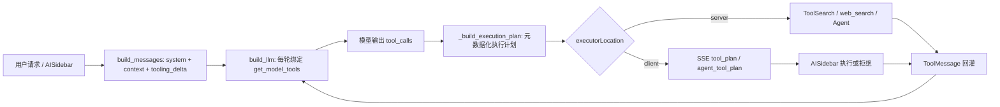

# OpenWPS Tool Harness 时间线说明

本文用“时间线 + 代码位置 + 复杂任务示例”解释当前 OpenWPS 的 Tool Harness。这里的 Harness 指：模型输出 `tool_calls` 之后，后端如何根据工具定义生成执行计划，如何决定服务端/前端执行、只读/写入权限、并发分组、延迟工具加载、子代理隔离，以及如何把工具结果重新回灌给下一轮模型。

## 一句话总览



## 核心代码地图

| 关注点 | 代码位置 | 作用 |
| --- | --- | --- |
| 单个工具的元数据契约 | `server/app/tool_registry.py:14`、`server/app/tool_registry.py:31` | `ToolMetadata` 声明类别、读写、执行位置、是否并发安全、是否 defer；`ToolDefinition` 提供 `prompt()`、`is_read_only()`、`to_openai_tool()`。 |
| 具体工具元数据 | `server/app/tool_registry.py:98` | `TOOL_METADATA` 给每个 legacy tool 补充 Harness 信息，例如 `Agent` 是服务端工具，`insert_table` 是写入且 deferred，`get_document_outline` 是只读并发安全。 |
| ToolSearch | `server/app/tool_registry.py:137`、`server/app/tool_registry.py:160` | 始终加载的服务端工具，用于按名称或关键词加载 deferred tool 的完整 schema。 |
| 通用工具使用原则 | `server/app/tool_registry.py:214` | `build_tool_guidance_section()` 生成 system prompt 里的工具策略，例如读取阶梯、写入阶梯、Agent 调度、verification 门槛、子代理只读边界。 |
| 模式工具池与 schema 生成 | `server/app/tooling.py:869`、`server/app/tooling.py:905` | `get_tool_definitions()` 按 `layout/edit/agent` 选工具；`get_model_tools()` 每轮生成模型可见 OpenAI-compatible tools schema。 |
| deferred tool 摘要附件 | `server/app/tooling.py:988` | `build_tooling_delta_attachment()` 生成 `[系统附件] type=tooling_delta`，告诉模型有哪些 deferred tools 只能先通过 `ToolSearch` 加载。 |
| system prompt 与 cache hash | `server/app/content.py:115` | `build_system_content()` 组合静态 system prompt + 工具使用原则，并计算 `toolSchemaHash`、prompt cache key trace。 |
| 请求消息拼装 | `server/app/ai.py:4241` | `build_messages()` 注入 system prompt、tooling delta、初始文档上下文、用户消息和附件。 |
| 每轮模型绑定 tools | `server/app/ai.py:4308` | `build_llm()` 用当前 loaded deferred 状态调用 `get_model_tools()`，再 `bind_tools()`。 |
| 执行计划对象 | `server/app/ai.py:2374` | `PlannedToolExecution` 是后端下发给前端前的规范化执行单元，包含 `executor_location/read_only/allowed_for_agent/parallel_safe`。 |
| 执行计划构造 | `server/app/ai.py:3158`、`server/app/ai.py:3481` | `_make_planned_execution()` 从 registry 派生元数据；`_build_execution_plan()` 把模型 tool calls 合并、排序、分组。 |
| 服务端/前端分流 | `server/app/ai.py:3181` | `_split_execution_plan()` 根据 `executorLocation` 把 `ToolSearch/web_search/Agent` 留在后端，把文档读写工具发给前端。 |
| ToolSearch 运行 | `server/app/ai.py:3420`、`server/app/ai.py:5005` | `_run_tool_search_tool()` 加载完整 schema；`_execute_server_execution()` 执行服务端工具并发送 `tooling_delta`。 |
| 主循环工具阶段 | `server/app/ai.py:5690` | 主 ReAct 流程从模型 `tool_calls` 生成 plan，先执行服务端工具，再通过 SSE 等前端工具结果。 |
| 前端计划类型 | `src/components/AISidebar.tsx:1169` | `ToolPlanExecution` 接收后端元数据。 |
| 前端计划解析 | `src/components/AISidebar.tsx:1340` | `parseToolPlanEvent()` 解析 `executorLocation/readOnly/allowedForAgent/parallelSafe`。 |
| 前端执行与拒绝 | `src/components/AISidebar.tsx:2611` | `executeAndPostToolResults()` 执行客户端工具；拒绝服务端工具误下发和子代理写入工具。 |
| 子代理定义与工具白名单 | `server/app/agents.py:18`、`server/app/agents.py:236` | `READ_ONLY_AGENT_TOOLS` 从 registry 派生；`resolve_agent_tool_names()` 只允许只读且 `subagent_ok` 的工具。 |
| 子代理 system prompt | `server/app/agents.py:242`、`server/app/content.py:337` | `build_agent_system_prompt()` 与 `build_subagent_content()` 为子代理独立组装 system prompt、父代理委托和上下文快照。 |
| 子代理执行循环 | `server/app/ai.py:5076` | `_run_subagent()` 使用独立 message history、独立工具池、独立 deferred 状态。 |

## 时间线：复杂任务如何跑完

示例用户请求：

> 把这份项目周报整理成给管理层看的简报：标题正式化，补齐执行摘要、风险和下一步行动，必要时插入行动项表格，最后用 verification 子代理自查是否满足要求。

### T0：工具先在 registry 中自声明能力

每个工具不是只靠 `tooling.py` 里的裸 schema 存在，而是被包装成 `ToolDefinition`。

- `ToolMetadata` 定义工具属性：`category/access/use_when/avoid_when/executor_location/parallel_safe/should_defer/subagent_ok`，位置是 `server/app/tool_registry.py:14`。
- `ToolDefinition.prompt()` 把原始 schema description 和 Harness 策略拼成模型可见的工具描述，位置是 `server/app/tool_registry.py:43`。
- `ToolDefinition.to_openai_tool()` 每次返回 deep copy 后的 OpenAI tool schema，不污染全局 schema，位置是 `server/app/tool_registry.py:66`。

这个示例里几个关键工具的定义位置：

- `get_document_outline`：`server/app/tool_registry.py:105`，只读、可并发、子代理可用，用于先看结构。
- `replace_paragraph_text`：`server/app/tool_registry.py:124`，写入工具，用于整段替换。
- `insert_table`：`server/app/tool_registry.py:120`，写入工具且 `should_defer=True`，首轮不会完整注入 schema。
- `Agent`：`server/app/tool_registry.py:103`，服务端工具，用于启动只读子代理。
- `web_search`：`server/app/tool_registry.py:133`，服务端工具且 deferred，仅外部事实或最新资料需要时使用。

### T1：请求进来时，先拼 content，不直接把所有工具硬塞进 system prompt

入口在 `server/app/ai.py:4241` 的 `build_messages()`。

它做四件事：

1. 调 `get_model_tools(body.mode, loaded)` 生成本轮模型真正可调用的 tools，位置是 `server/app/tooling.py:905`。
2. 调 `build_system_content()` 生成 system prompt，位置是 `server/app/content.py:115`。
3. 调 `_record_tooling_delta_message()` 注入 deferred 工具摘要附件，位置是 `server/app/ai.py:4220`。
4. 注入初始文档上下文和用户消息，位置是 `server/app/ai.py:4261` 到 `server/app/ai.py:4303`。

这里的分层很关键：

- System Prompt 层只放通用工具原则，由 `build_tool_guidance_section()` 生成，位置是 `server/app/tool_registry.py:214`。
- API Tools Schema 层每轮通过 `get_model_tools()` 动态生成，位置是 `server/app/tooling.py:905`。
- Delta / Attachment 层把高变动的 deferred 工具列表放进 `tooling_delta` attachment，位置是 `server/app/tooling.py:988`。

在这个示例里，模型首轮能直接看到核心读取、写入、Agent 和 `ToolSearch`，但看不到 `insert_table` 的完整 schema；它只会在 `tooling_delta` 里看到类似“`insert_table` 可通过 ToolSearch 加载”的摘要。

### T2：模型每一轮调用前，后端重新绑定当前 tools

入口是 `server/app/ai.py:4308` 的 `build_llm()`。

核心逻辑：

- `selected_tools = get_model_tools(...)` 在 `server/app/ai.py:4320`。
- `build_system_content(...)` 重新计算 `toolSchemaHash` 和 prompt cache 参数，在 `server/app/ai.py:4321`。
- `llm.bind_tools(selected_tools)` 在 `server/app/ai.py:4338`。

所以 ToolSearch 加载了新工具之后，下一轮 `build_llm()` 会把新工具的完整 schema 放进模型可调用工具池。这就是 deferred tools 生效的位置。

### T3：模型输出 tool_calls，后端把它们变成执行计划

主循环位置是 `server/app/ai.py:5690`：

```python
execution_plan = _build_execution_plan(self.state.round, round_tool_calls)
server_executions, client_executions = _split_execution_plan(execution_plan)
```

执行计划包含的元数据来自 registry：

- `_make_planned_execution()` 在 `server/app/ai.py:3158` 调 `get_tool_metadata_payload()`。
- `get_tool_metadata_payload()` 在 `server/app/tooling.py:931` 派生 `executorLocation/readOnly/parallelSafe/allowedForAgent`。
- `_assign_parallel_groups()` 在 `server/app/ai.py:2400` 只把 `parallelSafe=True` 的连续工具分到同一并发组。

假设模型首轮输出：

```json
[
  {"name": "get_document_outline", "params": {}},
  {"name": "search_text", "params": {"query": "风险"}},
  {"name": "ToolSearch", "params": {"query": "select:insert_table"}}
]
```

后端会形成三类执行：

- `get_document_outline` 和 `search_text` 是客户端只读工具，可能进入并发组。
- `ToolSearch` 是服务端工具，不发给前端。
- `insert_table` 此时还不会执行，只是通过 `ToolSearch` 加载完整 schema，供下一轮模型调用。

### T4：服务端工具先执行，ToolSearch 会改变后续工具池

主循环先执行 `server_executions`，位置是 `server/app/ai.py:5702`。

`ToolSearch` 的实际处理在两个地方：

- `_run_tool_search_tool()`：`server/app/ai.py:3420`，按 `query` 搜索 deferred tools，命中后 `loaded_deferred_tools.update(...)`。
- `_execute_server_execution()`：`server/app/ai.py:5005`，执行 `ToolSearch` 或 `web_search`，并把结果作为 `ToolMessage` 回灌。

ToolSearch 成功后会返回 `<functions>...</functions>` 结构，位置是 `server/app/ai.py:3458` 到 `server/app/ai.py:3466`。同时它发出 `tooling_delta` SSE，位置是 `server/app/ai.py:5059` 到 `server/app/ai.py:5073`。

前端收到这个事件后只更新用户可见状态，不执行工具，位置是 `src/components/AISidebar.tsx:3192`。

### T5：客户端工具通过 SSE 下发给 AISidebar 执行

如果有 `client_executions`，后端在 `server/app/ai.py:5741` 到 `server/app/ai.py:5762`：

1. 保存 `self.session.expected_plan`。
2. `yield _serialize_execution_plan(client_plan)` 发 `tool_plan` SSE。
3. 等待前端 POST `/api/ai/react/{session_id}/tool-results`。

`_serialize_execution_plan()` 的输出字段在 `server/app/ai.py:3588`：

```json
{
  "type": "tool_plan",
  "planId": "plan_xxx",
  "executions": [
    {
      "executionId": "exec_xxx",
      "toolName": "get_document_outline",
      "executorLocation": "client",
      "readOnly": true,
      "allowedForAgent": true,
      "parallelSafe": true
    }
  ]
}
```

前端对应位置：

- `ToolPlanExecution` 类型定义在 `src/components/AISidebar.tsx:1169`。
- `parseToolPlanEvent()` 解析 metadata，位置是 `src/components/AISidebar.tsx:1340`。
- `tool_plan` 事件处理在 `src/components/AISidebar.tsx:3178`。
- `executeAndPostToolResults()` 真正执行并 POST 结果，位置是 `src/components/AISidebar.tsx:2611`。
- `buildExecutionBatches()` 按 `parallelGroup/parallelSafe` 分批执行，位置是 `src/components/AISidebar.tsx:1195`。

前端还有两道保护：

- 如果后端误把 `executorLocation !== "client"` 的工具发给前端，前端拒绝，位置是 `src/components/AISidebar.tsx:2624`。
- 如果这是子代理计划且 `allowedForAgent=false`，前端拒绝，位置是 `src/components/AISidebar.tsx:2654`。

### T6：工具结果回灌给模型，进入下一轮

前端 POST 回来的结果在后端 `_apply_execution_results()` 处理，位置是 `server/app/ai.py:4972`。

关键动作：

- 按 `execution_id` 对齐结果，位置是 `server/app/ai.py:4977`。
- 对每个源 tool call 追加 `ToolMessage`，位置是 `server/app/ai.py:4989`。
- 记录 content trace 的 `tool_results` 元数据，位置是 `server/app/ai.py:4995`。

随后主循环继续 `_decide_tool_round()`，位置是 `server/app/ai.py:5793`。如果还需要继续，例如 ToolSearch 刚加载了 `insert_table`，下一轮模型会重新 `build_llm()`，这时 `insert_table` 的完整 schema 已可调用。

### T7：第二轮可以调用刚加载的 deferred tool

回到示例，第二轮模型可能输出：

```json
[
  {"name": "replace_paragraph_text", "params": {"index": 2, "text": "执行摘要：..."}},
  {"name": "insert_paragraph_after", "params": {"index": 8, "text": "下一步行动：..."}},
  {"name": "insert_table", "params": {"afterIndex": 9, "data": [["负责人", "事项", "截止时间"], ["产品", "确认范围", "周五"]]}}
]
```

这里 `insert_table` 能出现，是因为上一轮 `ToolSearch` 更新了 `loaded_deferred_tools`，而 `build_llm()` 每轮都会重新调用 `get_model_tools()`。

写入工具默认不会并发：

- `replace_paragraph_text`、`insert_paragraph_after`、`insert_table` 的 metadata 都不是 `parallel_safe=True`，见 `server/app/tool_registry.py:120` 到 `server/app/tool_registry.py:124`。
- `_assign_parallel_groups()` 遇到非并发安全工具会 flush 并发队列，位置是 `server/app/ai.py:2416` 到 `server/app/ai.py:2421`。

这保证了写入顺序更保守，降低段落索引漂移风险。

### T8：主 Agent 通过 Agent 工具启动 verification 子代理

如果主 Agent 判断是非平凡文档改动，需要验收，它会调用 `Agent` 工具，例如：

```json
{
  "name": "Agent",
  "params": {
    "subagent_type": "verification",
    "description": "检查管理层简报改写结果",
    "prompt": "核对标题、执行摘要、风险、下一步行动和行动项表格是否满足用户目标。"
  }
}
```

`Agent` 是服务端工具，定义在 `server/app/tool_registry.py:103`。主循环遇到它时走 `_execute_agent_execution()`，位置是 `server/app/ai.py:5702` 到 `server/app/ai.py:5711`，具体实现是 `server/app/ai.py:5352`。

verification 的内置定义在 `server/app/agents.py:181`：

- prompt 要求只读取当前状态，不做修改。
- 输出必须以 `PASS / PARTIAL / FAIL` 开头。
- 可用工具包括 `get_document_info/get_document_outline/get_document_content/get_page_content/get_paragraph/search_text/get_comments/TaskList`。

子代理工具白名单不是手写在前端，而是从 registry 派生：

- `READ_ONLY_AGENT_TOOLS` 在 `server/app/agents.py:18`。
- `resolve_agent_tool_names()` 在 `server/app/agents.py:236`，只保留只读、`subagent_ok=True`、当前可用的工具。

### T9：子代理有自己的 system prompt、工具池和结果回灌

同步子代理入口是 `_run_subagent()`，位置是 `server/app/ai.py:5076`。

它和主 Agent 不是共用同一个 message history：

- 子代理工具名由 `resolve_agent_tool_names()` 计算，位置是 `server/app/ai.py:5086` 到 `server/app/ai.py:5090`。
- `build_subagent_content()` 生成独立 system prompt 和 user prompt，位置是 `server/app/ai.py:5097` 和 `server/app/content.py:337`。
- 子代理每轮调用 `_select_model_tools_by_names()` 绑定自己的工具池，位置是 `server/app/ai.py:5132`。
- 子代理输出的 tool calls 也会变成 execution plan，位置是 `server/app/ai.py:5193`。

如果子代理需要读当前编辑器状态，后端发 `agent_tool_plan`：

- 后端序列化在 `server/app/ai.py:3612`。
- 子代理发送 plan 在 `server/app/ai.py:5257` 到 `server/app/ai.py:5273`。
- 前端接收 `agent_tool_plan` 在 `src/components/AISidebar.tsx:3116`。
- 前端在 `agent_progress.awaiting_tool_results` 时执行并 POST，位置是 `src/components/AISidebar.tsx:3072` 到 `src/components/AISidebar.tsx:3081`。

如果子代理误调用写入工具，前端会按 `allowedForAgent=false` 拒绝，位置是 `src/components/AISidebar.tsx:2654`。这就是“子代理只能给建议，不能直接改文档”的最后一道保险。

### T10：verification 结果作为 Agent 工具结果回到主 Agent

子代理结束时：

- `_run_subagent()` 产出 `_subagent_result`，位置是 `server/app/ai.py:5304` 到 `server/app/ai.py:5317`。
- `_execute_agent_execution()` 把它包装成 `Agent` 工具结果，位置是 `server/app/ai.py:5438` 到 `server/app/ai.py:5455`。
- 主循环把 `Agent` 的 `ToolMessage` 回灌给主 Agent，后续由主 Agent 决定是继续修复、再次验收，还是最终回复用户。

因此 verification 不是“自动改文档”的 agent，而是一个只读验收工具。它的输出进入主 Agent 上下文，主 Agent 才是唯一写入者。

## 与 Claude Code 分层机制的对应关系

| Claude Code 风格层 | OpenWPS 当前对应实现 | 是否已具备 |
| --- | --- | --- |
| Tool 定义层：每个 Tool 自声明 `prompt/inputSchema/permission/defer` | `ToolDefinition` + `ToolMetadata`，见 `server/app/tool_registry.py:14` 和 `server/app/tool_registry.py:31` | 已具备 |
| System Prompt 层：只注入通用工具原则 | `build_tool_guidance_section()` 追加到 `build_system_content()`，见 `server/app/tool_registry.py:214` 和 `server/app/content.py:115` | 已具备 |
| API Tools Schema 层：每次请求前动态生成 tools | `get_model_tools()` + `build_llm().bind_tools()`，见 `server/app/tooling.py:905` 和 `server/app/ai.py:4308` | 已具备 |
| Delta / Attachment 层：高变动工具信息通过附件注入 | `build_tooling_delta_attachment()` + `_record_tooling_delta_message()`，见 `server/app/tooling.py:988` 和 `server/app/ai.py:4220` | 已具备 |
| Deferred ToolSearch | `ToolSearch` + `_run_tool_search_tool()`，见 `server/app/tool_registry.py:137` 和 `server/app/ai.py:3420` | 已具备 |
| Subagent 层：子代理重复同一套注入流程 | `build_subagent_content()`、`_select_model_tools_by_names()`、`_run_subagent()`，见 `server/app/content.py:337`、`server/app/ai.py:3143`、`server/app/ai.py:5076` | 已具备 |
| MCP / Skill 动态生态 | `tooling_delta` 里预留 `mcpInstructionsDelta/skillDiscoveryDelta`，见 `server/app/tooling.py:1013` | 预留，未实现真实产品功能 |

## 一个可执行的复杂验证样例

当前仓库里已经有复杂场景的 mock E2E：`scripts/test-tool-harness.cjs`。

它验证的不是“明显造假的单工具调用”，而是一个更接近真实任务的链路：

1. 用户输入复杂周报改写需求。
2. mock SSE 先发 `tooling_delta`，提示有 deferred tools。
3. 第一轮工具包含读取、搜索和 `ToolSearch(select:insert_table)`。
4. ToolSearch 后出现 `tooling_delta`，表示 `insert_table` 已加载。
5. 后续计划执行多步文档改写和表格插入。
6. 再启动 `verification` 子代理。
7. 子代理只读工具可执行，但写入工具会被前端拒绝。
8. 最后断言页面无 console error，且 tool-results 请求体保留 `execution_id/plan_id/agent_id`。

运行命令：

```bash
npm run test:tool-harness
```

这个 E2E 对应验证的是上文 T1 到 T10 的前端可见闭环。

## 调试时看哪里

如果模型没有调用预期工具：

- 先看 `build_tool_guidance_section()` 是否把选择策略写清楚：`server/app/tool_registry.py:214`。
- 再看该工具是否被当前模式选中：`server/app/tooling.py:869`。
- 如果是 deferred tool，看 `tooling_delta` 是否出现它的摘要：`server/app/tooling.py:988`。
- 如果模型要直接调用 deferred tool，预期应该先调 `ToolSearch`，见 system guidance 的 `server/app/tool_registry.py:258`。

如果工具应该服务端执行却到了前端：

- 看 `executor_location` 是否配置正确：`server/app/tool_registry.py:24` 和具体 `TOOL_METADATA`。
- 看 `_split_execution_plan()`：`server/app/ai.py:3181`。
- 前端兜底拒绝位置：`src/components/AISidebar.tsx:2624`。

如果子代理改了文档或尝试改文档：

- 看 `READ_ONLY_AGENT_TOOLS` 是否只包含只读工具：`server/app/agents.py:18`。
- 看 `resolve_agent_tool_names()` 是否过滤掉写入工具：`server/app/agents.py:236`。
- 看前端 `allowedForAgent` 拒绝：`src/components/AISidebar.tsx:2654`。

如果 ToolSearch 后下一轮仍不能调用新工具：

- 看 `_run_tool_search_tool()` 是否更新了 `loaded_deferred_tools`：`server/app/ai.py:3436` 到 `server/app/ai.py:3439`。
- 看下一轮 `build_llm()` 是否传入同一个 `loaded_deferred_tools`：`server/app/ai.py:4308`。
- 看 `get_model_tools()` 是否把已加载 deferred tool 加回 schema：`server/app/tooling.py:914` 到 `server/app/tooling.py:921`。

## 容易混淆的点

1. `tooling_delta` 不是可调用工具 schema。它只是告诉模型“有这些 deferred tools，可用 ToolSearch 加载”。
2. `ToolSearch` 返回完整 schema 后，真正让模型能调用的是下一轮 `build_llm().bind_tools()`。
3. `allowedForAgent` 是给前端执行子代理计划时用的权限元数据，不是主 Agent 的写入权限。
4. 子代理的工具池和主 Agent 不同。子代理从 `resolve_agent_tool_names()` 重新过滤，只保留只读工具。
5. 写入工具不并发不是前端拍脑袋决定的，而是后端 registry 的 `parallel_safe` 经过 `_assign_parallel_groups()` 传给前端。
6. System prompt 不保存全部工具细节。单个工具的具体 `when/avoid/result` 进入 API tools schema description，高变动工具列表进入 attachment。
